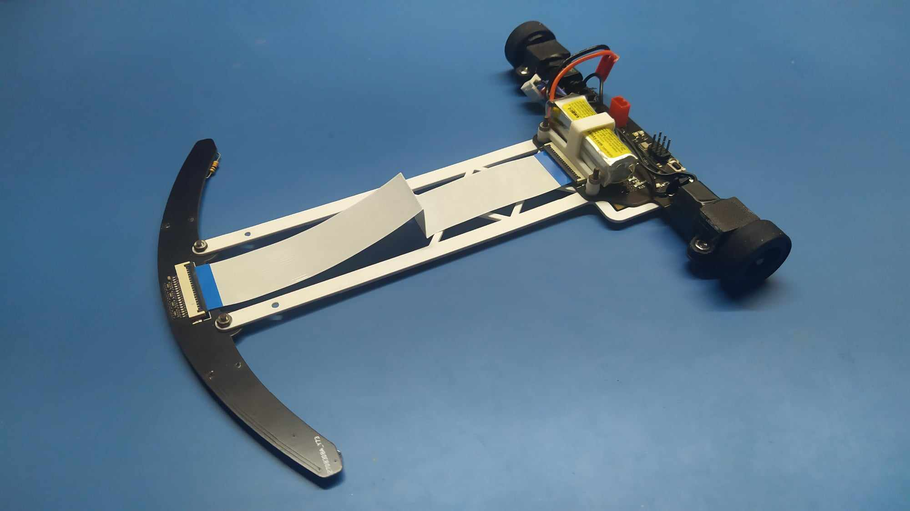
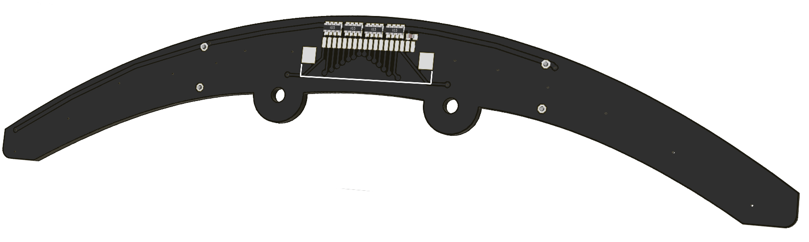
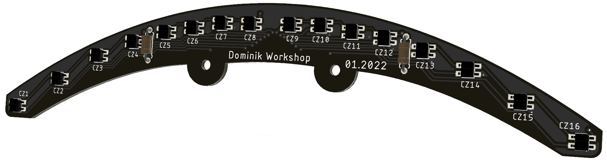
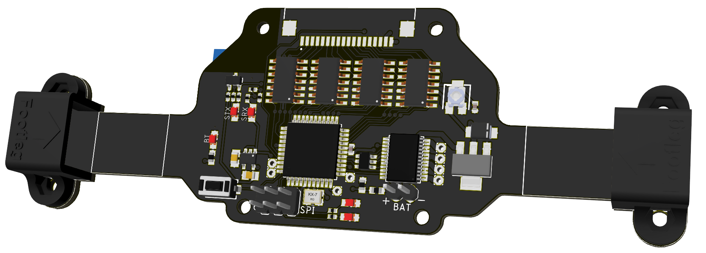
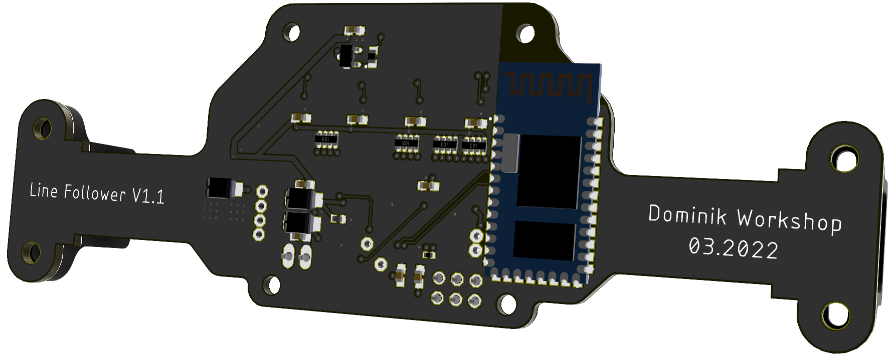
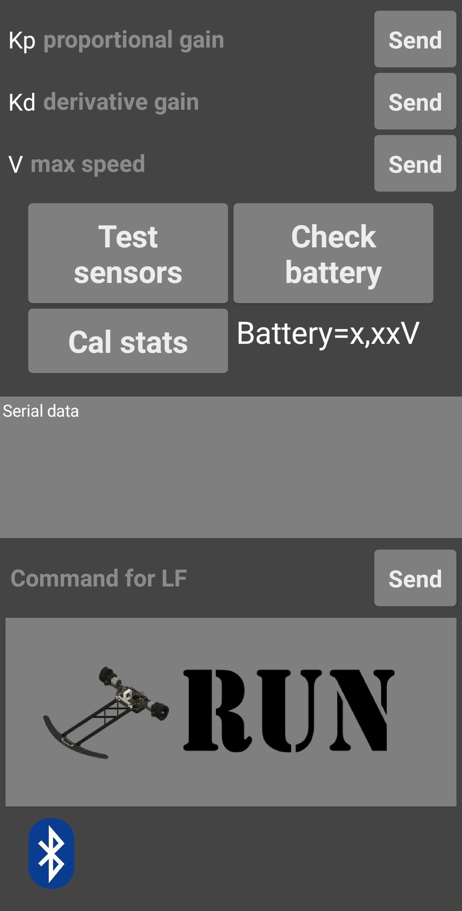
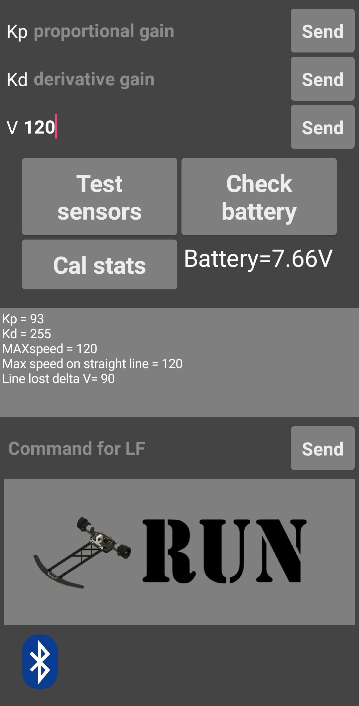
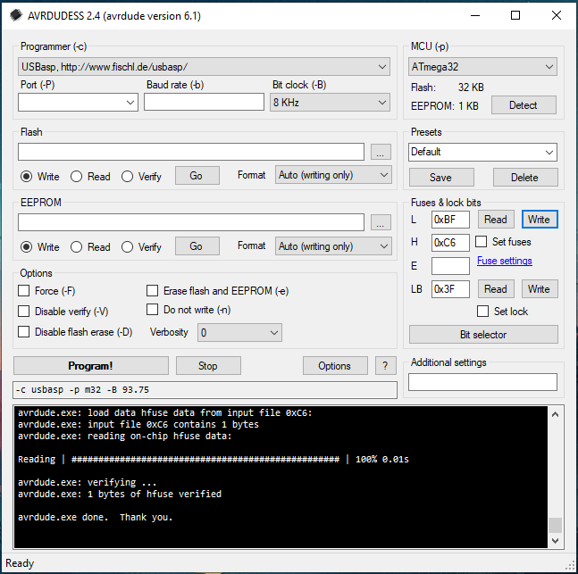

# Linefollower

## Used tools:
 &nbsp;&nbsp;&nbsp;&nbsp; &nbsp;&nbsp;&nbsp;&nbsp; 
 &nbsp;&nbsp;&nbsp;&nbsp; &nbsp;&nbsp;&nbsp;&nbsp; 
 &nbsp;&nbsp;&nbsp; &nbsp;&nbsp;&nbsp;&nbsp; 

## Project overwiev
The Linefollower Robot is designed to autonomously navigate a track marked by a black line on a white surface. The goal is for the robot to complete the track as quickly as possible.

## Electronics

The robot incorporates 2 PCBs, which are connected via an FFC cable:
  - sensor board - contains 16 reflective sensors for line detection
  
  
  - main board 
  
  

## Mechanical construction

The PCBs are mechanically joined with a lightweight 3D-printed connection bar. The motor and battery mounts are also 3D-printed.

## Android app

## Uploading the code to the robot
If the microcontroller doesn't programm:

Click to view solution

Make sure that the fusebits are set as bellow:

